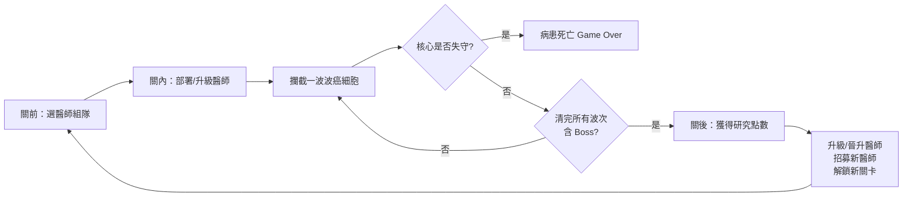
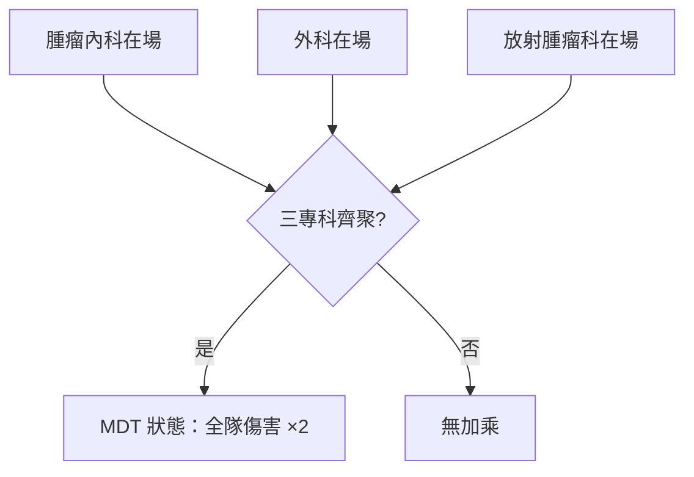
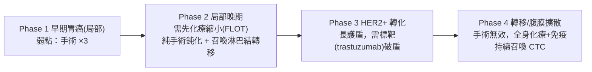

# 《Onco Defense｜腫瘤攻防戰》遊戲設計文件

> 像素風醫療塔防 — 外科醫師 × 腫瘤團隊 vs 癌細胞
> 版本：Design Draft v0.1（本文件為設計藍圖，尚未實作遊戲程式）

---

## 目錄
0. [設計原則：絕對模組化](#0-設計原則絕對模組化)
1. [遊戲概念與世界觀](#1-遊戲概念與世界觀)
2. [核心玩法迴圈](#2-核心玩法迴圈)
3. [傷害類型＝治療模式](#3-傷害類型治療模式)
4. [抗性系統](#4-抗性系統resistance-matrix)
5. [MDT 多專科會議加乘](#4b-mdt-多專科會議加乘)
6. [醫師職業（可部署塔）](#5-醫師職業可部署塔)
7. [敵人：依器官分類的癌細胞](#6-敵人依器官分類的癌細胞)
8. [頭目：各器官癌 Boss](#7-頭目各器官癌-boss)
9. [升級、晉升與技能](#8-升級晉升與技能)
10. [經濟與失敗條件](#9-經濟與失敗條件)
11. [部署系統](#9b-部署系統deployment)
12. [地圖設計](#10-地圖設計)
13. [像素美術與動畫規格](#11-像素美術與動畫規格)
14. [UI / HUD](#12-ui--hud)
15. [數值原型表（附錄）](#13-數值原型表附錄)
16. [實作路線圖](#14-實作路線圖)

---

## 現況與技術地基

現有 repo 名為 `threejs-procedural-tower-defense`，實際內容是一個 **procedural 地牢產生器（Dungeon Forge）**，沒有任何遊戲玩法。但它留下可直接複用的地基：

| 現有資產 | 位置 | 對本遊戲的用途 |
|---|---|---|
| 確定性 RNG `mulberry32` / `makeRng` | `src/main.js` L24–44 | 可重現的波次、關卡種子 |
| 資料驅動設定 `THEMES` | `src/main.js` L55–120 | 本文件所有 registry 的範本 |
| Procedural 地圖 + `bfs` 距離場 + 房間語意 | `src/main.js` L176–765 | 抽出血管/組織路徑供敵人尋路 |
| InstancedMesh 批次渲染 | `src/main.js` L1434–1900 | 低成本畫大量癌細胞/投射物 |
| 正交等距相機 + 後製特效 | `src/main.js` L767–2108 | 直接當本遊戲的呈現層 |

實作時「在這個渲染地基上蓋一整套塔防系統」，而非從零開始畫面層。

---

## 0. 設計原則：絕對模組化

> 最高原則：**後期新增癌族 / 醫師 / 治療 / 技能 / 關卡，只加資料、不改邏輯。**

所有遊戲內容都以**資料驅動、可插拔**方式定義，明確的解耦邊界如下：

### 0.1 獨立登錄表（registry）
所有內容各自是獨立清單，彼此以 **id 字串**互相參照，絕不硬編碼跨表關係：

```
DAMAGE_TYPES[]      // 治療模式
DOCTORS[]           // 可部署醫師（塔）
CANCER_FAMILIES[]   // 癌族（器官）  ─┐ 兩軸組合出實際敵人
CELL_ARCHETYPES[]   // 細胞型態      ─┘
ENEMIES[]           // = family × archetype 的具體實例
SKILLS[]            // 主動技/被動天賦
WAVES[]             // 波次腳本
BOSS_PHASES[]       // 頭目階段
MAPS[]              // 戰場（器官）與部署格
SYNERGIES[]         // 組隊加乘（如 MDT）
DEPLOYMENT          // 部署規則全域設定
```

### 0.2 抗性用「稀疏覆寫」
`RESIST_MATRIX` 只寫**非 1.0 的例外**（弱點 `3.0` / 抗性 `0.5`），未列出者一律預設 `1.0`。
→ 新增一種治療或一種敵人時，**不需要改動任何既有資料**。

```js
// 只寫例外，其餘皆 1.0
RESIST_MATRIX = {
  gastric_early:  { surgery: 3.0 },              // 早期胃癌：手術剋
  gastric_late:   { surgery: 0.5, chemo: 3.0 },  // 晚期：手術鈍化、化療剋
  hypoxic:        { radiation: 0.5, chemo: 0.5 },// 缺氧：放化療都鈍
  her2_marked:    { targeted: 3.0 },             // HER2+：標靶剋
}
```

### 0.3 能力用 component / flag 組合
敵人能力不是每種寫一個 class，而是**旗標自由組合**：

```
canBlock       被近戰醫師阻擋
flying         血行/不可被阻擋（走空中路徑）
selfHeal       持續自我修復（癌幹細胞）
splitOnDeath   死亡時分裂成小細胞（轉移灶）
markGated      帶標記，僅對標靶特別脆弱
shielded       有護盾，需特定治療破盾
regenPhase     頭目階段轉換時回血/換弱點
```

### 0.4 治療效果用 behavior 標籤
治療效果由**行為模組拼裝**，新治療＝挑行為 + 填數值：

```
single   單體
aoe      範圍
line     直線穿透
dot      持續傷害
summon   召喚小兵
buff     增益隊友
debuff   減益敵人（標記/緩速）
gated    需目標帶指定 flag 才生效（標靶）
```

### 0.5 像素資產命名規範
sprite sheet 依 `{unitId}_{state}` 命名，載入器依 id 自動綁定 → **新單位丟圖即接上**：

```
surgeon_idle.png   surgeon_attack.png   surgeon_hurt.png
gastric_early_move.png   gastric_early_death.png
```

### 0.6 擴充範例（文件承諾各附一則）
- **新增一個癌族**：只在 `CANCER_FAMILIES[]` 加一筆 + `RESIST_MATRIX` 寫弱點 + 丟 sprite。
- **新增一位醫師**：只在 `DOCTORS[]` 加一筆（含 `damageType` id 參照）+ 丟 sprite。
- **新增一種治療**：只在 `DAMAGE_TYPES[]` 加一筆（挑 behavior）+ 需要時在既有敵人補抗性例外。

---

## 1. 遊戲概念與世界觀

- 玩家 = **台大醫院腫瘤團隊的指揮者**。
- 癌細胞從**原發病灶**沿血管/淋巴管前進，目標是**病患的重要器官/生命核心**。
- 癌細胞抵達核心 → 扣「病患生命徵象（Lives）」；歸零 → **病患死亡（Game Over）**。
- 玩家在戰場格點**部署多位專科醫師（塔）**攔截清除癌細胞，並在關卡間**升級/招募**醫師。
- 基調：擬真醫療 + 像素風戰棋/塔防；**每關對應一種癌症與它的標準治療策略**，寓教於樂。

---

## 2. 核心玩法迴圈



- **關前**：從醫師名冊選 N 位組成出戰隊伍。
- **關內**：`研究經費 (DP)` 隨時間增長 → 部署/升級醫師 → 阻擋消滅波次 → 施放主動技能 → 守住核心直到清完（含 Boss）。
- **關後**：獲得研究點數 → 升級/晉升醫師、招募新醫師、解鎖章節。

---

## 3. 傷害類型＝治療模式

每種治療是一個 `damageType`，用 §0.4 的 behavior 標籤拼裝。

| 治療 (id) | 玩法定位 | behavior | 特性 | 真實對應 |
|---|---|---|---|---|
| **手術 `surgery`** | 近戰、單體高爆發 | `single` | 對局部實體瘤傷害極高；對已擴散/血液型鈍化 | 早期實體瘤根治性切除 |
| **化療 `chemo`** | 範圍持續傷害 | `aoe`+`dot` | 打所有「分裂中」細胞；對休眠/缺氧弱；有副作用機制 | 細胞毒殺、全身性 |
| **放射線 `radiation`** | 直線穿透、中距離 | `line` | 對局部病灶強 | 局部放療 |
| **標靶 `targeted`** | 標記門檻傷害 | `gated` | 只對帶對應標記(HER2/EGFR)高傷；無標記僅基礎傷害 | 精準醫療 |
| **免疫 `immuno`** | 輔助/召喚 | `summon`+`debuff` | 標記敵人增傷、召喚 T細胞/NK 小兵、慢熱滾雪球 | 免疫檢查點/細胞治療 |
| **荷爾蒙 `hormone`** | 減益/緩慢削血 | `dot`+`debuff` | 只對荷爾蒙驅動癌（ER+ 乳癌）有效、抑制生長 | 內分泌治療 |
| **消融/介入 `ablation`** | 定點高傷 | `single` | RFA/冷凍/TACE，對肝癌等不宜手術者的弱點解 | 介入放射學 |

> **副作用機制（化療）**：化療 AoE 範圍內若涵蓋「正常組織格」，會累積副作用值，過高時降低我方效率 — 教學「化療的全身毒性」，也讓玩家思考走位。

---

## 4. 抗性系統（Resistance Matrix）

每個敵人對每種 `damageType` 有一個傷害倍率，**下限 0.5、不存在「完全免疫(0)」**：

| 倍率 | 意義 |
|---|---|
| `0.5` | 抗性（最低，能打但很慢） |
| `1.0` | 普通（預設，稀疏表不寫） |
| `3.0` | **弱點**（被剋治療 ×3） |

### 設計理由
> 任何治療對任何細胞**至少造成 0.5 傷害** → 永遠不會有無解細胞、遊戲不卡死。
> 仍以 `0.5`（抗）↔ `3.0`（弱點）的 **6 倍落差**強力引導玩家選對治療。

### 規則
- **每一種癌症都必有「至少一個弱點」（`3.0`）**。
- 「**建議放射線**」＝ Radiation `3.0`、其餘 `0.5`（能打但很慢）→ 效果上強烈導向放射線，但不硬卡。「必手術/必化療」同理。

### 擬真對應
| 細胞 | 抗性 (0.5) | 弱點 (3.0) | 真實理由 |
|---|---|---|---|
| 缺氧細胞 | 放射線、化療 | 手術 / 標靶 | 血流差、氧氣與藥物到不了 |
| 抗藥 MDR 細胞 | 化療 | 依原癌族 | 多重抗藥性幫浦排出化療藥 |
| 血液/瀰漫型 | 手術 | 化療 / 免疫 | 全身性疾病無法靠切除 |
| 帶 HER2/EGFR 標記 | — | 標靶 | 有明確可打靶點 |

---

## 4b. MDT 多專科會議加乘

> **核心特色機制。** 真實腫瘤治療的黃金標準是**多專科團隊會議（Multidisciplinary Team, MDT / Tumor Board）**，由內科、外科、放射腫瘤科等共同決策。

### 機制
當場上**同時部署「腫瘤內科 + 外科 + 放射腫瘤科」三種專科**時：
- 觸發 **「多專科會議 (MDT)」狀態**
- **全隊所有醫師傷害 ×2**
- 專屬像素特效（會議室光暈 / 「MDT!」橫幅）與 HUD 提示

### 疊乘與上界
- 弱點 `×3` × MDT `×2` = **對症下藥 + 團隊合作 = 最大爆發**。
- 疊乘總上界由平衡表約束（避免爆數值），文件平衡表定義封頂值。

### 進階（擴充）
湊齊更多專科（病理 / 影像 / 標靶 / 免疫）可再疊更高階 buff 或解鎖限定技能 → 鼓勵**均衡組隊**而非單一堆疊。



---

## 5. 醫師職業（可部署塔）

共享屬性：`攻擊力 / 攻速 / 射程 / 部署費(DP) / 阻擋數(block) / 暴擊 / 自身HP / 技能`。
站位分**近戰（阻擋路徑）**與**遠程（後排輸出）**兩類。

| 醫師 | 站位 | damageType | 定位 |
|---|---|---|---|
| **外科醫師 Surgeon** | 近戰/阻擋 | `surgery` | 手術刀單體高爆發，物理阻擋癌細胞，對實體瘤強 |
| **腫瘤內科 Medical Oncologist** | 遠程/AoE | `chemo` | 化療 DoT 覆蓋一片路徑，打分裂快的細胞 |
| **放射腫瘤科 Radiation Oncologist** | 遠程/直線 | `radiation` | 穿透光束，對「建議放射線」敵人最有效解 |
| **免疫治療科 Immunologist** | 輔助 | `immuno` | 標記增傷、召喚 T細胞/NK 小兵、buff 隊友 |
| **標靶治療科 Precision Oncologist** | 遠程/條件 | `targeted` | 只對帶對應標記者高傷，高風險高報酬 |
| **介入放射科（擴充）** | 遠程/定點 | `ablation` | 消融/TACE，肝癌解 |
| **內分泌科（擴充）** | 輔助/減益 | `hormone` | ER+ 乳癌解 |
| **護理支援（擴充）** | 輔助 | — | 補病患生命、淨化副作用 |

- 以使用者提供的醫師像素圖作為角色立繪與 sprite 基礎，各對應一種專科。
- **MDT 觸發條件**：內科 + 外科 + 放射腫瘤三專科同時在場 → 全隊傷害 ×2（見 §4b）。

---

## 6. 敵人：依器官分類的癌細胞

> **設計原則：癌細胞依「原發器官」分族**，每族外觀/像素配色不同、行為不同，且**每族至少一個明確弱點（×3）**。
> 實際敵人 = **癌族（family） × 細胞型態（archetype）** 兩軸組合（§0.1）。

### 6.1 癌族（器官）

| 癌族 (id) | 主要弱點 (×3) | 抗性 (0.5) | 行為特徵 | 教學提示 |
|---|---|---|---|---|
| **乳癌 `breast`** | 依亞型：HER2+→標靶、ER+→荷爾蒙、三陰性→化療 | 亞型錯配時對應治療 0.5 | 會「亞型變異」切換弱點，逼玩家多專科 | 乳癌依受體亞型選治療 |
| **胃癌 `gastric`** | 早期→手術；HER2+→標靶 | 晚期/擴散時手術 0.5 | 隨分期由局部轉全身（見 Boss） | 早期開刀、晚期系統治療 |
| **大腸直腸癌 `colorectal`** | 結腸→手術；直腸→放射線(+化療) | 肝轉移對單一治療 0.5 | 易「肝轉移」分裂出轉移灶 | 直腸術前放化療、結腸根治手術 |
| **肝癌 `hcc`** | 消融/介入(RFA/TACE)、標靶 | 手術 0.5（肝功能差）、化療 0.5 | 血行擴散、會再生 | HCC 常不宜大手術，靠介入/標靶/免疫 |
| **肺癌 `lung`** | driver 突變(EGFR/ALK)→標靶；PD-L1→免疫 | 化療對耐藥株 0.5 | CTC 型不可阻擋、快速 | NSCLC 精準醫療、免疫治療 |

### 6.2 細胞型態（archetype，可套在任一癌族）
決定移動/防禦手感的通用小兵模板：

| 型態 (id) | flags | 特性 | 弱點傾向 |
|---|---|---|---|
| **分裂型 `rapid`** | 快、脆 | 高移速、低血 | 化療 |
| **實體瘤塊 `solid`** | `canBlock` 厚血慢 | 需被阻擋才好打 | 手術 |
| **缺氧細胞 `hypoxic`** | 抗放化療 | 龜血 | 手術/標靶 |
| **抗藥 MDR `resistant`** | 抗化療 | 拖延型 | 依原癌族 |
| **循環腫瘤細胞 `ctc`** | `flying` 不可阻擋 | 走血行路徑、快 | 遠程/免疫 |
| **癌幹細胞 `stem`** | `selfHeal` | 自我修復，需集火秒殺 | 集火 |
| **轉移灶 `mets`** | `splitOnDeath` | 死亡時分裂成小細胞 | AoE |

> 例：`gastric_solid`（胃癌實體瘤塊，怕手術）、`lung_ctc`（肺癌循環細胞，不可阻擋）。

---

## 7. 頭目：各器官癌 Boss

每個章節以一種器官癌為 Boss；每個 Boss **多階段、階段間切換弱點**，教學該癌治療策略。
**首發 Boss = 胃癌。**

### 7.1 胃癌 Boss（首關示範）
教學核心：**胃癌治療隨分期改變** — 早期開刀、晚期系統治療。



| 階段 | 弱點 (×3) | 鈍化 (0.5) | 特殊行為 |
|---|---|---|---|
| 1 早期 | `surgery` | — | — |
| 2 局部晚期 | `chemo` | `surgery` | `summon` 淋巴結轉移小兵 |
| 3 HER2+ | `targeted` | `surgery` | `shielded`，破盾才可打 |
| 4 轉移 | `chemo`,`immuno` | `surgery` | `summon` 循環腫瘤細胞 CTC |

### 7.2 其餘器官癌 Boss（後續章節綱要）
| Boss | 階段弱點流 |
|---|---|
| **乳癌** | 亞型三選一（HER2/ER/三陰性）→ 每階段換受體換弱點（標靶/荷爾蒙/化療） |
| **大腸直腸癌** | 直腸放化療 → 肝轉移轉手術+化療 |
| **肝癌** | 介入/消融 → 標靶+免疫 |
| **肺癌** | driver 突變標靶 → 抗藥後轉免疫/化療 |

> 依標準分期治療策略設計；實證細節可用 PubMed / ClinicalTrials MCP 補充，於各 Boss 節標註出處位置。

---

## 8. 升級、晉升與技能

- **關內等級**：擊殺得經驗 → 升等 → 提升數值。
- **晉升 (Elite Promotion, E0/E1/E2)**：關間用研究點數晉升 → 解鎖新技能與像素進階外觀。
- **技能**：
  - 主動技（充能後施放）：如「緊急手術」（爆發單體）、「全身化療」（全場 DoT）、「立體定位放療 SBRT」（高精度直線）。
  - 被動天賦（分支選擇）：走輸出向或工具向。
- **Meta 進度**：招募新醫師、升級隊伍、解鎖章節。

---

## 9. 經濟與失敗條件

- **關內貨幣 `DP（研究經費）`**：隨時間增長，用於部署與升級醫師。
- **病患生命 (Lives)**：癌細胞抵達核心扣血；歸零 = 病患死亡（Game Over）。
- **關後貨幣 研究點數**：招募/晉升/升級。

---

## 9b. 部署系統（Deployment）

塔防手感的核心，全部資料驅動、每張地圖/每位醫師可覆寫。

| 規則 | 說明 |
|---|---|
| **部署費 (DP)** | 每位醫師有 `deployCost`；場上 DP 隨時間回充，部署即扣除 |
| **可部署格** | 地圖格分「地面（近戰/阻擋位）」與「高地/後排（遠程位）」；醫師標 `deployTiles`，像素高亮可放位置 |
| **面向 (facing)** | 部署時選朝向，決定攻擊/阻擋方向；放置預覽顯示攻擊範圍 |
| **阻擋數 (block)** | 近戰醫師有 `blockCount`（可攔幾隻），被阻擋敵人停下互毆（觸發攻擊/受傷動畫）；遠程 `blockCount=0` |
| **同時部署上限** | 關卡限制 `maxDeployed`，逼玩家取捨與輪換 |
| **撤退/再部署** | 可主動撤下回收部分 DP；再部署有**冷卻**，避免無限搬位 |
| **技能施放** | 主動技可設「手動」或「自動」，有充能/冷卻 |

> **與 MDT 的策略張力**：MDT 判定看「同時在場」的專科組合（§4b）；部署上限與撤退冷卻會影響能否維持 MDT 加乘 → 玩家需在「湊 MDT」與「補當前弱點解」間取捨。

---

## 10. 地圖設計

- **Meta 地圖 = 台大醫院**：各科部為章節（外科部 / 腫瘤醫學部 / 影像醫學部 / 血液腫瘤科…），作為關卡選擇畫面。
- **戰場 = 人體器官/器官系統**：胃癌關 = 胃/上消化道；路徑 = 血管/淋巴管；核心 = 病患生命。
- **技術複用**：用現有 procedural generator 產生「血管/組織」迷宮，抽出 **path polyline**（由現成 `bfs` 距離場 + `corridor`/`doorway`/`entrance`/`boss` 房間語意導出）供敵人尋路；`entrance` = 原發病灶（敵人出生），`boss`/核心 = 病患生命（要守的終點）。

---

## 11. 像素美術與動畫規格

### 風格
像素風 sprite，於 three.js 場景中以 **billboard plane** 呈現（沿用現有等距相機與後製），或以 2D canvas overlay 疊在 3D 場景上。

### 動畫狀態
| 單位 | 狀態 |
|---|---|
| **醫師** | `idle` / `attack` / `skill` / `hurt`（受傷） / `down`（倒下） |
| **癌細胞** | `move` / `attack` / `hurt`（受傷） / `death`（凋亡爆裂） |

> 醫師與癌細胞**皆有攻擊與受傷動畫**（依使用者要求）；被阻擋時雙方互毆會分別播放 `attack` 與 `hurt`。

### 技術方案：sprite sheet + UV offset 逐格
- 每個 `{unitId}_{state}` 是一條 sprite sheet（水平排列 frames）。
- 用 `THREE.Texture` 的 `repeat` / `offset` 每格切換 UV → 逐格動畫。
- 規範每動作的 **frame 數 / 單格尺寸 / 播放速率(fps) / 是否循環**（例：`idle` 4f loop 6fps、`attack` 6f once 12fps、`hurt` 2f once、`death` 6f once）。

### 製作指引
以使用者提供的醫師像素圖為基準立繪，**擴展成各狀態 sprite sheet**（保持像素密度、限定色板、外框描邊一致）。

### 色板 / 圖示規範
- 每種 `damageType` 專屬色（手術=鋼藍、化療=毒紫、放射線=電黃、標靶=洋紅、免疫=青綠、荷爾蒙=粉、消融=橘）→ 投射物/範圍指示共用。
- 血條、部署格高亮、UI 圖示的像素尺寸與描邊規格。

---

## 12. UI / HUD

改造現有「產生器遙測」面板為戰鬥 HUD：

- **頂部**：病患生命 (Lives)、研究經費 (DP)、目前波次 / 總波次、MDT 狀態指示燈。
- **底部**：隊伍醫師卡（頭像 / 等級 / 技能充能條 / DP 費用）、部署選單。
- **選取敵人資訊卡**：點癌細胞顯示其癌族、型態、**抗性表**（哪種治療剋、哪種鈍）→ 教學面。
- **Boss 血條**：分段顯示階段與當前弱點圖示。

---

## 13. 數值原型表（附錄）

以下雛形可直接轉成 `config`（沿用 `THEMES` 風格、遵守 §0 模組化）。**皆為初始平衡起點，待實測調整。**

### DAMAGE_TYPES
```js
const DAMAGE_TYPES = [
  { id:'surgery',   name:'手術',   behavior:['single'],          color:0x4a90d9 },
  { id:'chemo',     name:'化療',   behavior:['aoe','dot'],       color:0x9b59b6, sideEffect:true },
  { id:'radiation', name:'放射線', behavior:['line'],            color:0xf1c40f },
  { id:'targeted',  name:'標靶',   behavior:['gated'],           color:0xe91e8c, gateFlag:'markGated' },
  { id:'immuno',    name:'免疫',   behavior:['summon','debuff'], color:0x1abc9c },
  { id:'hormone',   name:'荷爾蒙', behavior:['dot','debuff'],    color:0xff9ec4 },
  { id:'ablation',  name:'消融',   behavior:['single'],          color:0xe67e22 },
]
```

### DOCTORS（示例三位 MVP）
```js
const DOCTORS = [
  { id:'surgeon',  name:'外科醫師',   damageType:'surgery',   role:'melee',
    atk:40, atkSpeed:0.8, range:1, deployCost:12, blockCount:1, hp:200,
    deployTiles:['ground'], skills:['emergency_op'] },
  { id:'med_onc',  name:'腫瘤內科',   damageType:'chemo',     role:'ranged',
    atk:12, atkSpeed:1.2, range:3, deployCost:14, blockCount:0, hp:120,
    deployTiles:['highground'], skills:['systemic_chemo'] },
  { id:'rad_onc',  name:'放射腫瘤科', damageType:'radiation', role:'ranged',
    atk:22, atkSpeed:1.0, range:4, deployCost:16, blockCount:0, hp:110,
    deployTiles:['highground'], skills:['sbrt'] },
]
```

### CANCER_FAMILIES × CELL_ARCHETYPES
```js
const CANCER_FAMILIES = [
  { id:'gastric', name:'胃癌', color:0xc0392b },
  { id:'breast',  name:'乳癌', color:0xff69b4 },
  { id:'lung',    name:'肺癌', color:0x95a5a6 },
  // colorectal, hcc ...
]
const CELL_ARCHETYPES = [
  { id:'rapid',     name:'分裂型', hp:20,  speed:1.6, flags:[] },
  { id:'solid',     name:'實體瘤', hp:120, speed:0.6, flags:['canBlock'] },
  { id:'ctc',       name:'循環腫瘤細胞', hp:35, speed:1.8, flags:['flying'] },
  { id:'stem',      name:'癌幹細胞', hp:80, speed:0.9, flags:['selfHeal'] },
  { id:'mets',      name:'轉移灶', hp:50, speed:1.0, flags:['splitOnDeath'] },
  // hypoxic, resistant ...
]
// 具體敵人 = family + archetype，例：{ family:'gastric', archetype:'solid' }
```

### RESIST_MATRIX（稀疏，只寫例外）
```js
const RESIST_MATRIX = {
  // key 可用 family / archetype / marker，查表時取乘積
  gastric_early: { surgery:3.0 },
  gastric_late:  { surgery:0.5, chemo:3.0 },
  breast_her2:   { targeted:3.0 },
  breast_er:     { hormone:3.0 },
  lung_driver:   { targeted:3.0 },
  lung_pdl1:     { immuno:3.0 },
  hcc:           { surgery:0.5, chemo:0.5, ablation:3.0, targeted:3.0 },
  hypoxic:       { radiation:0.5, chemo:0.5, surgery:3.0 },
  resistant:     { chemo:0.5 },
  // 未列出者 = 1.0
}
```

### SYNERGIES（MDT）
```js
const SYNERGIES = [
  { id:'mdt', name:'多專科會議',
    require:['med_onc','surgeon','rad_onc'], // 三專科同時在場
    effect:{ allyDamageMult:2.0 },
    fx:'mdt_banner' },
]
```

### DEPLOYMENT（全域）
```js
const DEPLOYMENT = {
  dpStart:20, dpRegenPerSec:1.2,
  maxDeployed:6,
  redeployCooldownSec:20,
  retreatRefundRatio:0.5,
  damageMultCap:6.0, // 弱點×MDT 疊乘封頂
}
```

### BOSS_PHASES（胃癌）
```js
const BOSS_PHASES = {
  gastric_boss:[
    { hpPct:1.00, weakness:['surgery'] },
    { hpPct:0.70, weakness:['chemo'],           resist:['surgery'], summon:'gastric_node' },
    { hpPct:0.45, weakness:['targeted'],        resist:['surgery'], flags:['shielded'] },
    { hpPct:0.20, weakness:['chemo','immuno'],  resist:['surgery'], summon:'gastric_ctc' },
  ],
}
```

### WAVES（示意）
```js
const WAVES = [
  { t:0,  spawn:[{enemy:'gastric_rapid', n:6, gap:1.0}] },
  { t:15, spawn:[{enemy:'gastric_solid', n:3, gap:2.0}] },
  { t:40, spawn:[{enemy:'gastric_boss',  n:1 }] },
]
```

---

## 14. 實作路線圖

> 本輪僅產出本設計文件，**不寫遊戲程式**。以下為之後落地建議。

### 階段 A：垂直切片 MVP
- 1 張地圖（胃/上消化道）、3 位醫師（外科/內科/放腫）、3 種傷害（手術/化療/放射線）、幾種敵人型態、胃癌 Boss。
- 打通：敵人尋路 → 部署 → 攻擊/抗性計算 → DP 經濟 → 波次 → Boss 階段 → 勝負。
- 驗證 MDT ×2、弱點 ×3、抗性下限 0.5 三條規則實際成立。

### 階段 B：內容擴充（驗證模組化）
- 依 §0.6 範例流程加入乳癌/大腸直腸癌/肝癌/肺癌與其 Boss、其餘醫師與治療、晉升/技能樹、meta 進度。
- 每次擴充只加資料、不改核心邏輯。

### 可複用的現有資產
- `mulberry32` / `makeRng`（`src/main.js` L24–44）：波次/關卡種子。
- generator 的 `bfs` / `grid` / 房間語意（L176–765）：導出敵人路徑。
- InstancedMesh 批次（L1434–1900）：渲染大量敵人/投射物。
- 相機 + 後製（L767–2108）：呈現層。

---

*本文件為設計藍圖，數值為初始起點，一切以實測平衡為準。醫學對應遵循標準腫瘤學分期治療原則（早期→手術、晚期→系統治療、HER2→標靶、ER+→荷爾蒙、driver 突變→標靶、PD-L1→免疫），供教育性參考，非臨床指引。*
